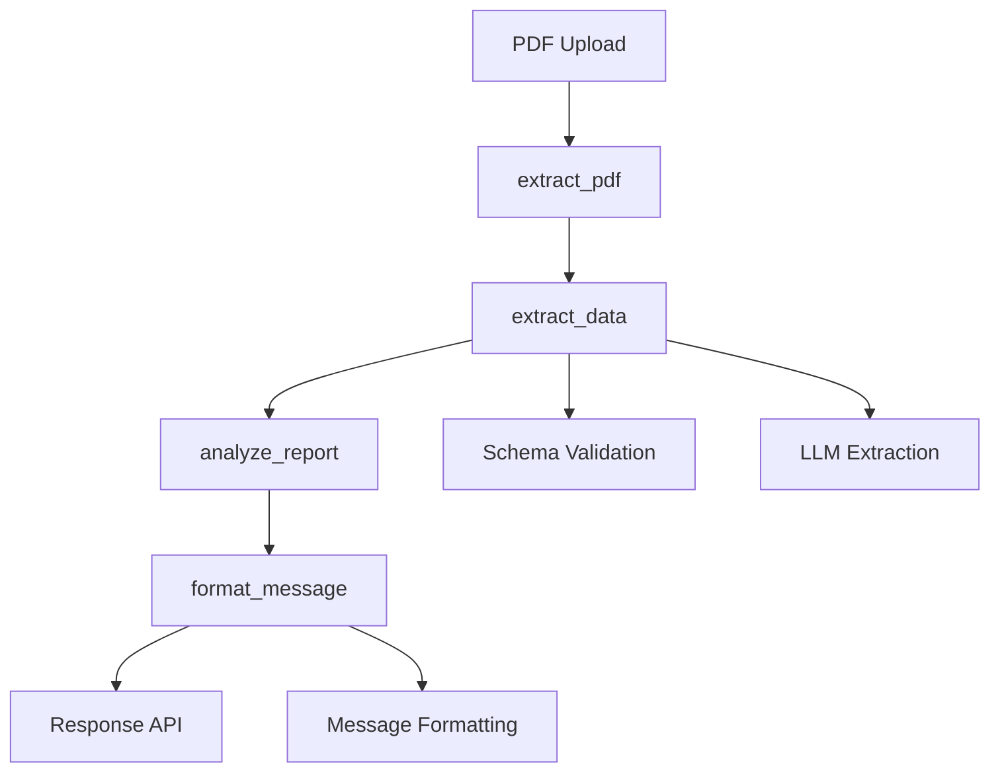

# Plano: Adicionar Campo Patrimônio Bruto (grossEquity)

## Objetivo

Incluir o campo "grossEquity" (patrimônio total bruto) em todo o fluxo de análise de relatórios XP, garantindo compatibilidade retroativa e validação adequada.

## Fluxo de Dados Atual



## Arquivos a Modificar

### 1. Backend - Schemas JSON

**Arquivo:** `ai-service/app/services/report_analyzer/schemas.py`

**Mudanças:**

- Adicionar campo `grossEquity` em `EXTRACTED_DATA_SCHEMA_OPTIMIZED` (após `reportMonth`)
- Adicionar campo `grossEquity` em `EXTRACTED_DATA_SCHEMA_FULL` (após `reportMonth`)
- Adicionar `"grossEquity"` na lista `required` de ambos os schemas
- Tipo: `string`, formato: `"R$ X.XXX,XX"`

**Risco:** Baixo - Campo novo, não quebra compatibilidade

### 2. Backend - Prompts de Extração

**Arquivo:** `ai-service/app/services/report_analyzer/prompts.py`

**Mudanças:**

- **XP_REPORT_EXTRACTION_PROMPT_OPTIMIZED:** Adicionar item 3 na lista de campos obrigatórios:
  ```
  3. grossEquity: Patrimônio total bruto (formato: R$ X.XXX,XX) - Procure por "PATRIMÔNIO TOTAL BRUTO" ou "PATRIMÔNIO BRUTO" no relatório
  ```

- **XP_REPORT_EXTRACTION_PROMPT_FULL:** Mesma adição (item 3)

**Risco:** Baixo - Apenas instrução adicional ao LLM

### 3. Backend - Validação de Dados

**Arquivo:** `ai-service/app/services/report_analyzer/nodes/extract_data.py`

**Mudanças:**

- Função `_validate_extracted_data` (linha ~382): Adicionar `"grossEquity"` na lista `required_fields`
- Manter validação não-estrita (warnings, não erro fatal) para compatibilidade

**Risco:** Médio - Pode gerar warnings em dados antigos, mas não quebra o fluxo

### 4. Backend - Filtragem de Dados (Modo Personalizado)

**Arquivo:** `ai-service/app/services/report_analyzer/nodes/format_message.py`

**Mudanças:**

- Função `_filter_data_by_selection` (linha ~186): Adicionar `"grossEquity"` na lista `top_level_fields` (linha ~203)
- Função `_filter_data_for_analysis` (linha ~254): Adicionar `"grossEquity"` na lista `top_level_fields` (linha ~282)
- Sempre incluir `grossEquity` quando presente (similar a `accountNumber` e `reportMonth`)

**Risco:** Baixo - Campo opcional na filtragem

### 5. Backend - Prompts de Formatação

**Arquivo:** `ai-service/app/services/report_analyzer/prompts.py`

**Mudanças:**

- **XP_MESSAGE_FORMAT_PROMPT_AUTO:** Adicionar linha no modelo obrigatório (após "Olá, *[N° do Cliente]!*"):
  ```
  Seu patrimônio bruto está em *[grossEquity]*.
  ```

- **XP_MESSAGE_FORMAT_PROMPT_CUSTOM:** Adicionar mesma linha no resumo da performance (se `grossEquity` estiver nos dados selecionados)

**Risco:** Baixo - Apenas formatação de saída

### 6. Frontend - Tipos TypeScript

**Arquivo:** `src/types/index.ts`

**Mudanças:**

- Interface `ExtractedData` (linha ~155): Adicionar `grossEquity: string;` após `reportMonth`
- Interface `SelectedFields` (linha ~184): Adicionar `grossEquity?: boolean;` na lista de campos opcionais

**Risco:** Baixo - Campo opcional no frontend

### 7. Frontend - Componente de Seleção

**Arquivo:** `src/components/chat/PromptBuilderDialog.tsx`

**Mudanças:**

- Adicionar checkbox para `grossEquity` na seção de campos top-level (similar a `monthlyReturn`)
- Incluir na lógica de `onCheckboxChange` para campos top-level

**Risco:** Baixo - Funcionalidade opcional

## Estratégia de Implementação Segura

### Fase 1: Backend - Extração e Validação (Não-Quebra)

1. Adicionar campo nos schemas JSON (com validação opcional inicialmente)
2. Atualizar prompts de extração
3. Adicionar validação com warning (não erro fatal)
4. Testar com PDFs reais

### Fase 2: Backend - Formatação

1. Adicionar campo na filtragem
2. Atualizar prompts de formatação
3. Testar mensagens geradas

### Fase 3: Frontend - Tipos e UI

1. Atualizar tipos TypeScript
2. Adicionar checkbox na UI
3. Testar fluxo completo

### Fase 4: Validação Estrita (Opcional)

1. Tornar campo obrigatório na validação após confirmação de estabilidade
2. Atualizar testes

## Validações e Testes

### Testes Unitários

- `test_extract_data.py`: Verificar extração de `grossEquity`
- `test_format_message.py`: Verificar inclusão na mensagem
- `test_analyze_report.py`: Verificar que não quebra análise

### Testes de Integração

- Testar com PDF real (ex: `XPerformance - 2463656 - Ref.25.09.pdf`)
- Verificar formato: `"R$ 571.279,61"`
- Validar que aparece na mensagem final

### Compatibilidade Retroativa

- Dados antigos sem `grossEquity` devem continuar funcionando (warning apenas)
- Mensagens antigas não devem quebrar

## Pontos de Atenção

1. **Formato do Valor:** Garantir formato brasileiro `R$ X.XXX,XX` (vírgula decimal, ponto milhar)
2. **Localização no PDF:** Campo aparece como "PATRIMÔNIO TOTAL BRUTO" na seção "EVOLUÇÃO PATRIMONIAL"
3. **Validação Gradual:** Começar com warning, evoluir para obrigatório após estabilidade
4. **Frontend Opcional:** Campo pode não aparecer na UI inicialmente (modo personalizado)

## Rollback Plan

Se houver problemas:

1. Remover campo dos `required` dos schemas (tornar opcional)
2. Remover validação estrita
3. Manter prompts atualizados (LLM pode extrair mesmo sem validação estrita)

## Checklist de Implementação

- [ ] Atualizar schemas JSON (OPTIMIZED e FULL)
- [ ] Atualizar prompts de extração (OPTIMIZED e FULL)
- [ ] Adicionar validação (com warning)
- [ ] Atualizar filtragem (format_message.py)
- [ ] Atualizar prompts de formatação (AUTO e CUSTOM)
- [ ] Atualizar tipos TypeScript
- [ ] Adicionar checkbox no PromptBuilderDialog
- [ ] Testar extração com PDF real
- [ ] Testar formatação de mensagem
- [ ] Validar compatibilidade retroativa