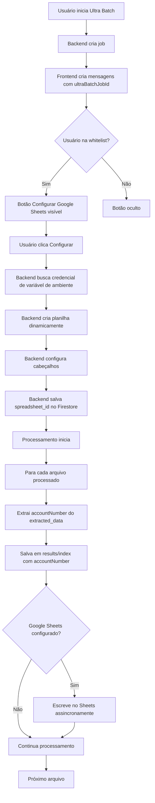

# Plano: Integração Google Sheets para Ultra Batch

## Objetivo

Implementar exportação automática de resultados de ultra batch para Google Sheets, com extração do `accountNumber` e escrita incremental assíncrona. Usa uma única credencial configurada no sistema (variável de ambiente) e cria planilhas dinamicamente (uma por job).

## Arquitetura



## Estrutura de Dados Firestore

### 1. Documento de Resultado (modificado)

**Caminho:** `ultra_batch_jobs/{jobId}/results/{index}`

**Campos adicionados:**

- `accountNumber` (string): Número da conta extraído do relatório

**Estrutura completa:**

```json
{
  "fileName": "XPerformance - 5629450 - Ref.29.08 (1).pdf",
  "accountNumber": "5629450",  // NOVO
  "success": true,
  "final_message": "Olá, *5629450*!...",
  "error": null,
  "processedAt": Timestamp
}
```

### 2. Configuração Google Sheets (novo)

**Caminho:** `google_sheets_config/{jobId}`

**Estrutura:**

```json
{
  "spreadsheet_id": "1ABC...",  // Criado automaticamente pelo backend
  "spreadsheet_url": "https://docs.google.com/spreadsheets/d/1ABC...",  // URL completa
  "spreadsheet_name": "Ultra Batch - job_123 - 2024-01-15",  // Nome gerado automaticamente
  "sheet_name": "Resultados",  // Sempre o mesmo
  "enabled": true,
  "created_by": "user_id",
  "created_at": Timestamp
}
```

**Nota:** Credenciais não são armazenadas no Firestore. São lidas de variável de ambiente `GOOGLE_SHEETS_SERVICE_ACCOUNT_KEY`.

### 3. Whitelist (novo)

**Caminho:** `config/google_sheets_whitelist`

**Estrutura:**

```json
{
  "user_ids": ["user_id_1", "user_id_2"],
  "roles": ["admin"]  // Roles com acesso automático
}
```

## Implementação

### Backend (Python)

#### 1. Modificar `ultra_batch_processing.py`

**Arquivo:** `ai-service/app/services/report_analyzer/ultra_batch_processing.py`

**Alterações:**

- Linha ~248-251: Extrair `accountNumber` do `extracted_data` e adicionar ao `result_data`
- Linha ~193-200: Adicionar `accountNumber: ""` em casos de erro
- Linha ~305-310: Adicionar `accountNumber: ""` em erros de IA
- Linha ~283: Após salvar resultado, chamar serviço Google Sheets assincronamente

**Código específico:**

```python
# Após linha 248, modificar:
if result.get("success"):
    result_data["final_message"] = result.get("data", {}).get("final_message")
    result_data["error"] = None
    
    # Extrair accountNumber
    extracted_data = result.get("data", {}).get("extracted_data", {})
    result_data["accountNumber"] = extracted_data.get("accountNumber", "") if extracted_data else ""
    
    success_count += 1
    
    # Integração Google Sheets (assíncrona, não bloqueante)
    if result_data.get("accountNumber") and result_data.get("final_message"):
        try:
            from app.services.report_analyzer.google_sheets_service import write_ultra_batch_result_to_sheets
            asyncio.create_task(
                write_ultra_batch_result_to_sheets(
                    job_id,
                    result_data["accountNumber"],
                    result_data["final_message"]
                )
            )
        except Exception as e:
            print(f"[ULTRA-BATCH] ⚠️ Erro ao agendar Google Sheets: {e}")
```

#### 2. Adicionar função em `config.py`

**Arquivo:** `ai-service/app/config.py`

**Nova função:**

```python
def get_google_sheets_credentials():
    """
    Retorna credenciais do Service Account para Google Sheets.
    Lê de variável de ambiente GOOGLE_SHEETS_SERVICE_ACCOUNT_KEY.
    
    Suporta:
 - Base64 (como SERVICE_ACCOUNT_KEY_INTERNAL)
 - JSON direto
    
    Returns:
        dict: Credenciais do Service Account como dicionário
    
    Raises:
        ValueError: Se variável não estiver configurada ou inválida
    """
    service_account_key = os.getenv("GOOGLE_SHEETS_SERVICE_ACCOUNT_KEY")
    
    if not service_account_key:
        raise ValueError("GOOGLE_SHEETS_SERVICE_ACCOUNT_KEY não configurada")
    
    try:
        # Se começa com '{', é JSON direto
        if service_account_key.strip().startswith('{'):
            return json.loads(service_account_key)
        else:
            # É base64
            decoded = base64.b64decode(service_account_key).decode('utf-8')
            return json.loads(decoded)
    except Exception as e:
        raise ValueError(f"Erro ao processar GOOGLE_SHEETS_SERVICE_ACCOUNT_KEY: {e}")
```

#### 3. Criar `google_sheets_service.py`

**Arquivo:** `ai-service/app/services/report_analyzer/google_sheets_service.py`

**Funções principais:**

- `create_spreadsheet_for_job_async()`: Cria uma nova planilha Google Sheets dinamicamente
- `write_row_to_sheets_async()`: Escreve uma linha no Google Sheets de forma assíncrona
- `setup_sheet_headers()`: Configura cabeçalhos da planilha (executar uma vez)
- `write_ultra_batch_result_to_sheets()`: Função principal que busca configuração e escreve
- `_get_sheets_service()`: Obtém serviço Google Sheets usando credenciais de `config.py`

**Características:**

- Criação dinâmica de planilhas (uma por job)
- Nome automático: "Ultra Batch - {jobId_short} - {data}"
- Credenciais lidas de variável de ambiente (não do Firestore)
- Execução em thread pool (Google API é síncrona)
- Retry com exponential backoff para rate limits (429)
- Cache de serviços Google (evita recriar a cada chamada)
- Tratamento silencioso de erros (não quebra o job)

**Scopes necessários:**

```python
scopes = [
    'https://www.googleapis.com/auth/spreadsheets',
    'https://www.googleapis.com/auth/drive.file'  # Para criar arquivos
]
```

**Função de criação de planilha:**

```python
async def create_spreadsheet_for_job_async(
    job_id: str,
    custom_name: Optional[str] = None
) -> Dict[str, Any]:
    """
    Cria uma nova planilha Google Sheets para um job.
    Usa credenciais de GOOGLE_SHEETS_SERVICE_ACCOUNT_KEY.
    
    Args:
        job_id: ID do job
        custom_name: Nome personalizado (opcional)
    
    Returns:
        {
            'spreadsheet_id': '1ABC...',
            'spreadsheet_url': 'https://docs.google.com/...',
            'sheet_name': 'Resultados',
            'spreadsheet_name': 'Ultra Batch - job_123 - 2024-01-15'
        }
    """
    # Buscar credenciais de config.py
    # Executar em thread pool
    # Criar planilha via API
    # Configurar cabeçalhos automaticamente
    # Retornar spreadsheet_id, URL e nome
```

#### 4. Adicionar endpoints em `report.py`

**Arquivo:** `ai-service/app/api/report.py`

**Novos endpoints:**

- `POST /api/report/ultra-batch/configure-sheets`: Cria planilha e configura integração para um job
- `GET /api/report/ultra-batch/sheets-config/{job_id}`: Retorna configuração existente
- `POST /api/report/ultra-batch/check-whitelist`: Verifica se usuário está na whitelist

**Request body para configure-sheets:**

```json
{
  "job_id": "job_123",
  "custom_name": "Nome Personalizado"  // Opcional
}
```

**Response:**

```json
{
  "success": true,
  "spreadsheet_id": "1ABC...",
  "spreadsheet_url": "https://docs.google.com/...",
  "spreadsheet_name": "Ultra Batch - job_123 - 2024-01-15"
}
```

**Validações:**

- Verificar whitelist antes de permitir configuração
- Validar que job pertence ao usuário
- Verificar se `GOOGLE_SHEETS_SERVICE_ACCOUNT_KEY` está configurada
- Criar planilha automaticamente usando credenciais do sistema

#### 5. Dependências

**Arquivo:** `ai-service/pyproject.toml`

**Adicionar:**

```toml
google-api-python-client = "^2.100.0"
google-auth = "^2.25.0"
google-auth-oauthlib = "^1.1.0"
```

### Frontend (TypeScript/React)

#### 1. Criar componente `GoogleSheetsConfigButton.tsx`

**Arquivo:** `src/components/chat/GoogleSheetsConfigButton.tsx`

**Funcionalidades:**

- Verifica se usuário está na whitelist (via hook ou prop)
- Modal de confirmação simples (sem formulário complexo)
- Campo opcional: `custom_name` (input): Nome personalizado da planilha
- Mensagem: "Uma planilha Google Sheets será criada automaticamente para este job. Deseja continuar?"
- Feedback visual (loading, success, error)
- Exibe link para planilha criada após sucesso

**Props:**

```typescript
interface GoogleSheetsConfigButtonProps {
  jobId: string;
  onConfigured?: (spreadsheetUrl: string) => void;
  userRole?: UserRole;
}
```

**Nota:** Não precisa mais de `credentials_json` - credenciais são configuradas no sistema via variável de ambiente.

#### 2. Criar hook `useGoogleSheetsWhitelist.ts`

**Arquivo:** `src/hooks/use-google-sheets-whitelist.ts`

**Funcionalidade:**

- Verifica se usuário está na whitelist
- Busca role do usuário
- Cache local para evitar múltiplas chamadas

**Retorno:**

```typescript
{
  isAuthorized: boolean;
  isLoading: boolean;
  error: string | null;
}
```

#### 3. Integrar botão em `ChatMessageArea.tsx`

**Arquivo:** `src/app/chat/ChatMessageArea.tsx`

**Localização:**

- Renderizar botão próximo ao indicador de progresso do ultra batch
- Apenas para mensagens com `source === 'ultra_batch'` e `role === 'assistant'`
- Verificar whitelist antes de renderizar

**Código aproximado:**

```typescript
{msg.source === 'ultra_batch' && msg.role === 'assistant' && msg.ultraBatchJobId && isAuthorized && (
  <GoogleSheetsConfigButton 
    jobId={msg.ultraBatchJobId}
    userRole={userRole}
  />
)}
```

#### 4. Criar server action `google_sheets_actions.ts`

**Arquivo:** `src/app/actions.ts` (adicionar funções)

**Funções:**

- `configureGoogleSheets()`: Chama endpoint que cria planilha e configura integração
  - Recebe: `jobId`, `customName?` (opcional)
  - Retorna: `spreadsheetUrl`, `spreadsheetId`, `spreadsheetName`
- `getGoogleSheetsConfig()`: Busca configuração existente
- `checkGoogleSheetsWhitelist()`: Verifica whitelist

### Configuração Inicial

#### 1. Criar documento de whitelist no Firestore

**Caminho:** `config/google_sheets_whitelist`

**Estrutura inicial:**

```json
{
  "user_ids": [],
  "roles": ["admin"]
}
```

#### 2. Configurar variável de ambiente

**Variável:** `GOOGLE_SHEETS_SERVICE_ACCOUNT_KEY`

**Formato:**

- Base64 (recomendado): chave JSON codificada em base64
- JSON direto: chave JSON como string

**Como configurar:**

1. Criar Service Account no Google Cloud Console
2. Gerar chave JSON
3. Habilitar APIs necessárias:

   - Google Sheets API
   - Google Drive API (para criar arquivos)

4. Codificar JSON em base64 (ou usar JSON direto)
5. Configurar variável de ambiente no Cloud Run / ambiente de produção

**Exemplo:**

```bash
# Base64 (recomendado)
GOOGLE_SHEETS_SERVICE_ACCOUNT_KEY=$(cat service-account.json | base64)

# Ou JSON direto
GOOGLE_SHEETS_SERVICE_ACCOUNT_KEY='{"type":"service_account",...}'
```

**Nota:** Não precisa compartilhar planilhas manualmente - o Service Account cria as planilhas automaticamente.

## Fluxo de Uso

1. **Usuário inicia ultra batch**

   - Job é criado no Firestore
   - Mensagens são criadas com `ultraBatchJobId`

2. **Usuário (whitelist) configura Google Sheets**

   - Clica no botão "Configurar Google Sheets"
   - Confirma criação da planilha (modal simples)
   - Opcionalmente fornece nome personalizado
   - Backend busca credenciais de variável de ambiente
   - Backend cria planilha automaticamente
   - Backend configura cabeçalhos automaticamente
   - Backend salva spreadsheet_id e URL no Firestore
   - Frontend exibe link para a planilha criada

3. **Processamento**

   - Para cada arquivo:
     - Extrai `accountNumber` do `extracted_data`
     - Salva em `results/{index}` com `accountNumber`
     - Se Google Sheets configurado: escreve linha assincronamente

4. **Resultado**

   - Planilha é atualizada em tempo real
   - Colunas: `Número da Conta` | `Mensagem WhatsApp`

## Segurança

1. **Whitelist:**

   - Verificação no backend (não confiar apenas no frontend)
   - Roles com acesso automático: `admin`
   - Lista específica de `user_ids` no Firestore

2. **Credenciais:**

   - Credenciais armazenadas em variável de ambiente (não no Firestore)
   - Mais seguro: credenciais não expostas no frontend
   - Validação de existência da variável no backend
   - Não retornar credenciais em endpoints GET
   - Tratamento de erro se variável não estiver configurada

3. **Validação:**

   - Verificar que job pertence ao usuário antes de configurar
   - Verificar se `GOOGLE_SHEETS_SERVICE_ACCOUNT_KEY` está configurada
   - Validar que Service Account tem permissões necessárias (Sheets + Drive APIs)
   - Tratamento de erro se credenciais forem inválidas ou APIs não habilitadas
   - Não precisa validar permissões em planilha existente (planilha é criada automaticamente)

## Testes

1. **Backend:**

   - Testar extração de `accountNumber` em diferentes cenários
   - Testar criação dinâmica de planilhas
   - Testar leitura de credenciais de variável de ambiente (base64 e JSON)
   - Testar escrita no Google Sheets com retry
   - Testar validação de whitelist
   - Testar tratamento de erros (variável não configurada, credenciais inválidas, APIs não habilitadas, rate limits)

2. **Frontend:**

   - Testar renderização condicional do botão
   - Testar modal de confirmação (sem formulário complexo)
   - Testar campo opcional de nome personalizado
   - Testar exibição de link da planilha após criação
   - Testar feedback visual (loading, success, error)

## Considerações

1. **Rate Limits:**

   - Google Sheets: ~60 requests/segundo
   - Com 4500 arquivos: ~75 segundos mínimo
   - Retry com backoff garante resiliência

2. **Performance:**

   - Escrita assíncrona não bloqueia processamento
   - Cache de serviços Google reduz overhead
   - Thread pool evita bloqueio do event loop

3. **Manutenção:**

   - Documentar processo de criação de Service Account
   - Documentar como habilitar APIs (Sheets + Drive)
   - Documentar como configurar variável de ambiente `GOOGLE_SHEETS_SERVICE_ACCOUNT_KEY`
   - Documentar como adicionar usuários à whitelist
   - Considerar limpeza de configurações e planilhas antigas
   - Considerar política de retenção de planilhas criadas
   - Considerar rotação de credenciais (atualizar variável de ambiente)

## Ordem de Implementação

1. Adicionar função `get_google_sheets_credentials()` em `config.py` (backend)
2. Extrair e salvar `accountNumber` (backend)
3. Criar serviço Google Sheets com função de criação dinâmica (backend)
4. Adicionar endpoints de configuração que criam planilhas (backend)
5. Configurar variável de ambiente `GOOGLE_SHEETS_SERVICE_ACCOUNT_KEY` (infraestrutura)
6. Criar componente de UI simplificado (frontend)
7. Integrar botão na interface (frontend)
8. Configurar whitelist inicial (Firestore)
9. Testes end-to-end (criação de planilha, escrita incremental)

## Vantagens da Criação Dinâmica

1. **Isolamento:** Cada job tem sua própria planilha
2. **Simplicidade:** Usuário não precisa criar planilha manualmente
3. **Escalabilidade:** Suporta múltiplos usuários e jobs simultâneos
4. **Rastreabilidade:** Nome da planilha inclui jobId e data
5. **Automação:** Cabeçalhos configurados automaticamente

## Vantagens da Credencial Única

1. **Segurança:** Credenciais não expostas no frontend
2. **Simplicidade:** Usuário não precisa fornecer credenciais
3. **Controle:** Uma Service Account gerenciada centralmente
4. **Manutenção:** Atualização em um único lugar (variável de ambiente)
5. **Consistência:** Todas as planilhas criadas com as mesmas permissões